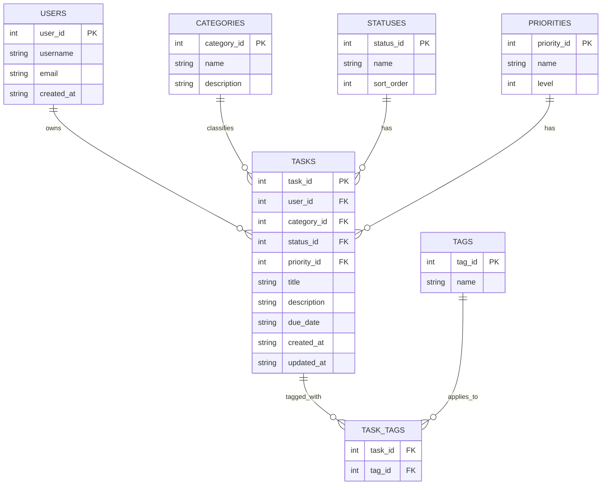

# Task Management & Data Tracking System

A multi-tier command-line application for managing tasks with normalized
relational storage, many-to-many tag associations, and query-optimized
lookups. Built with Python and SQLite.

## Overview

This project implements a small but complete task-tracking system with a
focus on **correct relational schema design** and **clean separation of
concerns** between the database layer, data access layer, business logic,
and presentation.

It supports:

- Multiple users with unique usernames and emails
- Tasks with title, description, due date, category, priority, and status
- Many-to-many tagging across tasks
- Full CRUD operations (create, read, update, delete)
- Referential integrity enforced at the database level
- Index-backed query performance

The project is intentionally small in scope so the schema design and
layered architecture are easy to inspect and reason about.

## Architecture

The application is split into four layers, each with a single
responsibility:

| Layer | File | Responsibility |
|---|---|---|
| Connection | `db.py` | Open SQLite connections with foreign keys enforced; load schema; seed lookup tables |
| Repository | `repository.py` | All SQL statements. The only place that touches the database directly. |
| Service | `service.py` | Business logic: validation, name-to-ID resolution, orchestration |
| Presentation | `main.py` | CLI menu, user input, output formatting |

This separation means:

- **SQL is not scattered across the codebase.** All queries live in
  `repository.py`. Changing the database engine (e.g., PostgreSQL) would
  require changes to only one file.
- **Business rules are testable in isolation.** `service.py` can be
  unit-tested without running the CLI.
- **The CLI is replaceable.** A web API or GUI could be added without
  modifying the repository or service layers.

## Project Structure

```
task_manager/
├── schema.sql        # DDL: tables, constraints, indexes
├── db.py             # Connection layer + seed data
├── repository.py     # Data access layer (all SQL)
├── service.py        # Business logic layer
├── main.py           # CLI presentation layer
└── README.md
```

## Database Schema

The schema is normalized to **Third Normal Form (3NF)**. Lookup values
(status, priority, category) are stored in their own tables rather than
as inline strings on the `tasks` table, so they can be reused, renamed,
and validated without modifying task rows.

### Entity-Relationship Diagram



### Tables

| Table | Purpose |
|---|---|
| `users` | Task owners |
| `categories` | Lookup table for task categories (Work, Personal, etc.) |
| `statuses` | Lookup table for task states (Pending, In Progress, Done) |
| `priorities` | Lookup table for priority levels with numeric sort |
| `tasks` | Main entity; foreign keys to users, categories, statuses, priorities |
| `tags` | Tag names |
| `task_tags` | Junction table implementing many-to-many between tasks and tags |

## Design Decisions

### Why 3NF instead of one flat table

A single `tasks` table with inline strings for category, status, and
priority would have several problems:

- **Update anomalies:** Renaming "In Progress" to "Active" would require
  updating every task row.
- **No validation:** Any string could be inserted as a status.
- **No reuse:** Category descriptions and priority ordering would have
  to be duplicated per task.

Splitting lookup values into their own tables removes these issues. Every
non-key column depends only on the primary key of its table, which is the
definition of 3NF.

### Why the `task_tags` junction table has a composite primary key

```sql
PRIMARY KEY (task_id, tag_id)
```

This makes duplicate associations impossible: the same tag cannot be
attached to the same task twice. A surrogate `id` column plus a separate
unique constraint would also work, but the composite key expresses the
constraint directly and removes the need for an extra index.

### ON DELETE behavior

| Foreign key | Behavior | Rationale |
|---|---|---|
| `tasks.user_id → users` | `CASCADE` | Deleting a user removes their tasks |
| `tasks.category_id → categories` | `SET NULL` | Deleting a category leaves tasks intact, just uncategorized |
| `tasks.status_id → statuses` | `RESTRICT` | A status in use cannot be deleted |
| `tasks.priority_id → priorities` | `RESTRICT` | A priority in use cannot be deleted |
| `task_tags.task_id → tasks` | `CASCADE` | Deleting a task removes its tag links |
| `task_tags.tag_id → tags` | `CASCADE` | Deleting a tag removes its task links |

`RESTRICT` on statuses and priorities prevents accidentally orphaning
active tasks. `CASCADE` on user and task deletion keeps the database
consistent without manual cleanup.

### CHECK constraints

- `email LIKE '%_@_%._%'` — rejects obviously malformed emails
- `length(title) > 0` — tasks must have a title
- `due_date LIKE '____-__-__'` — enforces ISO date format
- `level BETWEEN 1 AND 5` — priority levels are bounded

These are simple guards, not full validators. A production system would
use a real email validator and a date parser, but SQL-level checks
prevent the most common garbage from entering the database.

## Query Optimization

### Indexes

Indexes are defined on every foreign key and on the most common filter
column (`due_date`):

```sql
CREATE INDEX idx_tasks_user_id     ON tasks(user_id);
CREATE INDEX idx_tasks_status_id   ON tasks(status_id);
CREATE INDEX idx_tasks_priority_id ON tasks(priority_id);
CREATE INDEX idx_tasks_due_date    ON tasks(due_date);
CREATE INDEX idx_task_tags_tag_id  ON task_tags(tag_id);
```

These are the columns the application filters and joins on most
frequently:

- "Show me my tasks" → `WHERE user_id = ?`
- "Show me pending tasks" → `WHERE status_id = ?`
- "Sort by due date" → `ORDER BY due_date`

Without indexes, SQLite performs a **full table scan** — it reads every
row to find matches. With indexes, it performs an **index seek** — it
jumps directly to the matching rows.

### Verifying with EXPLAIN QUERY PLAN

The `repository.explain_plan()` function wraps SQLite's
`EXPLAIN QUERY PLAN` command, which shows how the query planner will
execute a statement.

**Example query:**

```sql
SELECT t.task_id, t.title
FROM tasks t
WHERE t.user_id = ? AND t.status_id = ?
ORDER BY t.due_date
```

**Output with indexes:**

```
SEARCH t USING INDEX idx_tasks_user_id (user_id=?)
```

The phrase `USING INDEX` confirms the planner is using the index
rather than scanning the table.

**Output without indexes (for comparison):**

```
SCAN t
```

`SCAN` means a full table scan. This contrast is the evidence that the
indexes are doing their job.

> **Note:** Run `python main.py`, choose option 5 (Query Plan), and paste
> the actual output here before publishing this README.

## How to Run

### Requirements

- Python 3.9+
- No external dependencies. `sqlite3` ships with Python.

### Setup

```bash
git clone https://github.com/Joshua-i-Sun/Projects
cd task_manager
python main.py
```

On first run, `db.py` creates `tasks.db`, loads `schema.sql`, and seeds
the lookup tables (statuses, priorities, categories).

### Usage

The CLI presents a numbered menu. If the username does not exist, you
are prompted for an email and registered as a new user. Otherwise, you
are greeted as a returning user.

```
1. Add Task
2. View My Tasks
3. Mark Done
4. Delete
5. Query Plan
6. Exit
```

### Example session

```
Enter username: joshua
Enter email to register: joshua@example.com
Registered new user (id=1).

1. Add Task  2. View My Tasks  3. Mark Done  4. Delete  5. Query Plan  6. Exit
Choose (1-6): 1
Title: Finish README
Description: Write documentation for Task Manager
Due date (YYYY-MM-DD): 2026-09-20
Category (Work/Personal): Work
Priority (Low/Medium/High): High
Task created (id=1).

Choose (1-6): 2
[1] Finish README | High | Pending | due 2026-09-20
```

## Limitations & Future Improvements

**Current limitations:**

- CLI only — no web interface
- No authentication beyond username lookup
- Single-process, single-file SQLite database
- No automated tests included in this repository
- Date validation only checks format, not validity (e.g., `2026-13-45`
  would pass the `LIKE` check)

**Future improvements:**

- Add a pytest suite covering the repository and service layers
- Replace the `LIKE` date check with a real date parser
- Add a FastAPI or Flask REST API on top of `service.py`
- Add soft-delete (`deleted_at` timestamp) instead of hard delete
- Add per-user tags and category preferences
- Migrate to PostgreSQL for multi-user concurrent access

## License

This project is for educational and portfolio purposes.